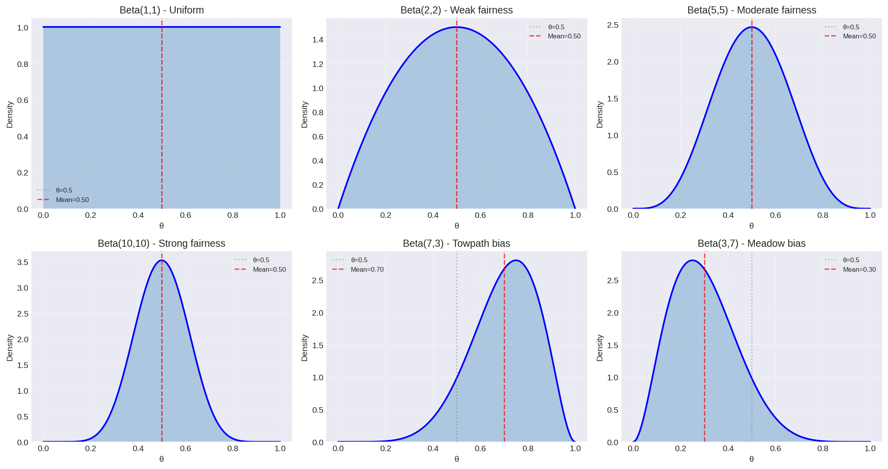
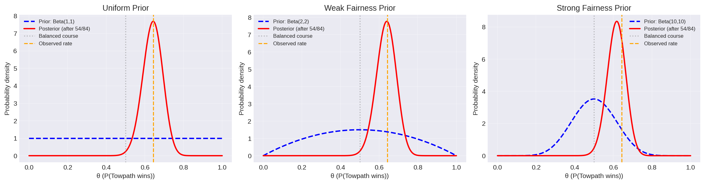
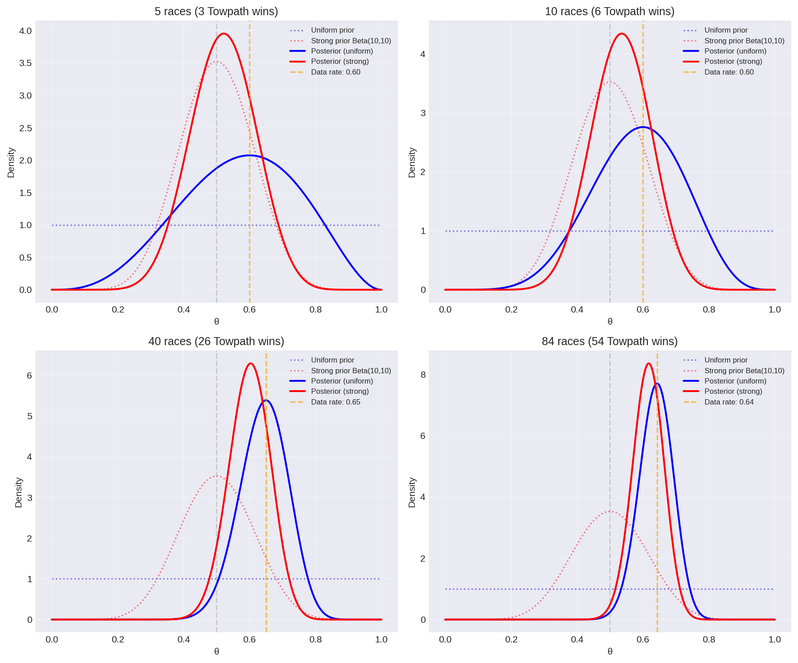

# Analytical Bayesian Update: The Rowing Example

← Back to [[index]] | Previous: [[bayes-theorem]]

---

## A Real Problem: Is the Course Balanced?

In the 1999s Rowbridge Reborn regatta, there were **84 races** on the River Cam:
- **Towside** (towpath side) won **54 races**
- **Meadow** side won **30 races**

**Context:** Like a 400m running track, the river has a **bend**. To compensate, the race organizers **deliberately skewed the finish line toward Meadow side** to make the course fair.

**Sides are randomly assigned** to crews before each race, so this isn't about which crews are better.

**Question:** Is the finish line skew sufficient to balance the course, or does Towpath still have an advantage?

**Frequentist answer:** Hypothesis test gives p-value = 0.0043, "significant evidence that towpath side is faster."

**The snarky comment:** "Maybe the finish line being skewed in favour of meadow isn't something to complain about" — i.e., the skew was *supposed* to help Meadow, but Towpath wins anyway.

We can quantify this properly with Bayesian inference.

---

## Setting Up the Problem

### The Parameter

Let $\theta$ = probability that Towpath side wins a race (with random crew assignment).

- If $\theta = 0.5$: Course is balanced (finish line skew compensates for bend perfectly)
- If $\theta > 0.5$: Towpath has geometric advantage (finish line skew is insufficient)
- If $\theta < 0.5$: Meadow has advantage (finish line skew overcompensates)

### The Data

We observed $n = 84$ races with $k = 54$ Towpath wins.

---

## The Beta-Binomial Model

This is a classic conjugate pair (same setup as the [[bayes-theorem#Worked Example: The Coin Flip|coin flip example]]).

### The Likelihood

Given $\theta$, the probability of observing $k$ wins in $n$ races follows the **Binomial distribution**:

$$p(k|\theta, n) = \binom{n}{k}\theta^k(1-\theta)^{n-k}$$

Substituting our data ($n=84$, $k=54$):

$$\mathcal{L}(\theta) = \binom{84}{54}\theta^{54}(1-\theta)^{30}$$

### The Prior

We need to choose a prior $\pi(\theta)$ on $[0,1]$. The **Beta distribution** is the natural choice:

$$\pi(\theta) = \text{Beta}(\theta|\alpha, \beta) = \frac{\theta^{\alpha-1}(1-\theta)^{\beta-1}}{B(\alpha,\beta)}$$

**But what values for $\alpha$ and $\beta$?** See [[prior-choice]] for a detailed discussion. For now, let's try a few:

**Option 1: Uniform prior** $\text{Beta}(1, 1)$
- "I have no idea if there's an advantage"
- Every value of $\theta$ is equally likely a priori

**Option 2: Weak fairness prior** $\text{Beta}(2, 2)$
- "I weakly believe the organizers set the finish line correctly ($\theta \approx 0.5$)"
- Equivalent to having seen 1 Towpath win and 1 Meadow win before

**Option 3: Strong fairness prior** $\text{Beta}(10, 10)$
- "I strongly believe the organizers measured the course carefully and balanced it"
- Equivalent to having seen 9 wins each side in test races
- Requires stronger data to conclude the course is imbalanced

#### What Do These Priors Look Like?

Different Beta distributions encode different beliefs:



**Key observations:**
- **Beta(1,1)** is flat — complete uncertainty
- **Symmetric Betas** (α=β) are peaked at 0.5
- **Larger α+β** = stronger prior (narrower distribution)
- **Asymmetric Betas** (α≠β) encode bias toward one outcome

### The Posterior

Using [[bayes-theorem]], the posterior is:

$$p(\theta|k,n) \propto \theta^k(1-\theta)^{n-k} \cdot \theta^{\alpha-1}(1-\theta)^{\beta-1}$$

$$= \theta^{k+\alpha-1}(1-\theta)^{n-k+\beta-1}$$

**This is another Beta distribution!**

$$\boxed{p(\theta|k,n) = \text{Beta}(\theta | \alpha + k, \beta + n - k)}$$

**Beautiful conjugacy:** Prior beliefs (encoded as $\alpha-1$ Towpath wins, $\beta-1$ Meadow wins) combine additively with observed data ($k$ Towpath wins, $n-k$ Meadow wins).

---

## Computing the Posteriors

### Case 1: Uniform Prior $\text{Beta}(1,1)$

**Posterior:** $\text{Beta}(1 + 54, 1 + 30) = \text{Beta}(55, 31)$

**Posterior mean:**

$$\mathbb{E}[\theta] = \frac{\alpha}{\alpha+\beta} = \frac{55}{86} \approx 0.640$$

**95% credible interval:**
```python
from scipy.stats import beta
import numpy as np

# Posterior distribution
posterior = beta(55, 31)

# Credible interval
lower, upper = posterior.ppf([0.025, 0.975])
print(f"θ = {posterior.mean():.3f}")
print(f"95% CI: [{lower:.3f}, {upper:.3f}]")
```

**Output:**
```
θ = 0.640
95% CI: [0.547, 0.728]
```

**Interpretation:** There's a 95% probability that Towpath's win rate is between 54.7% and 72.8%. The data support that the course is imbalanced — the finish line skew doesn't fully compensate for the bend.

### Case 2: Weak Fairness Prior $\text{Beta}(2,2)$

**Posterior:** $\text{Beta}(56, 32)$

**Posterior mean:** $\frac{56}{88} \approx 0.636$

**95% CI:** $[0.544, 0.724]$

Nearly identical to the uniform prior—the data dominate.

### Case 3: Strong Fairness Prior $\text{Beta}(10,10)$

**Posterior:** $\text{Beta}(64, 40)$

**Posterior mean:** $\frac{64}{104} \approx 0.615$

**95% CI:** $[0.527, 0.700]$

Pulled slightly toward 0.5 by the stronger prior (belief that organizers measured carefully), but data still show clear geometric advantage for Towpath.

---

## Visualizing the Update

```python
import matplotlib.pyplot as plt
import numpy as np
from scipy.stats import beta

theta = np.linspace(0, 1, 1000)

# Three priors
prior1 = beta(1, 1)    # Uniform
prior2 = beta(2, 2)    # Weak fairness
prior3 = beta(10, 10)  # Strong fairness

# Three posteriors (after observing 54/84 Towpath wins)
post1 = beta(55, 31)
post2 = beta(56, 32)
post3 = beta(64, 40)

fig, axes = plt.subplots(1, 3, figsize=(15, 4))

# Plot each case
cases = [
    (prior1, post1, "Uniform Prior", "Beta(1,1)"),
    (prior2, post2, "Weak Fairness Prior", "Beta(2,2)"),
    (prior3, post3, "Strong Fairness Prior", "Beta(10,10)")
]

for ax, (prior, post, title, prior_label) in zip(axes, cases):
    ax.plot(theta, prior.pdf(theta), 'b--', linewidth=2,
            label=f'Prior: {prior_label}')
    ax.plot(theta, post.pdf(theta), 'r-', linewidth=2,
            label=f'Posterior (after 54/84)')
    ax.axvline(0.5, color='gray', linestyle=':', alpha=0.5,
               label='Balanced course')
    ax.axvline(54/84, color='orange', linestyle='--',
               label='Observed rate')
    ax.set_xlabel('θ (P(Towpath wins))')
    ax.set_ylabel('Probability density')
    ax.set_title(title)
    ax.legend(fontsize=8)
    ax.grid(True, alpha=0.3)

plt.tight_layout()
plt.show()
```



**Key insight:** With 84 races, the data overwhelm even the strong prior. All three posteriors concentrate around $\theta \approx 0.63-0.64$.

### How Much Data Is Needed?

With more data, priors matter less. Here's how posteriors evolve as we collect more races:



**Observation:** By 40+ races, even a strong fairness prior (red) converges to the same posterior as a uniform prior (blue). The data dominate!

---

## Answering the Question

### Probability Towpath Has Advantage

We can directly compute: What's the probability that $\theta > 0.5$?

```python
# Using uniform prior posterior
posterior = beta(55, 31)
prob_advantage = 1 - posterior.cdf(0.5)
print(f"P(θ > 0.5 | data) = {prob_advantage:.4f}")
```

**Output:**
```
P(θ > 0.5 | data) = 0.9984
```

**Bayesian answer:** There's a 99.84% probability that the course is imbalanced in favor of Towpath (i.e., the finish line skew is insufficient).

Compare this to the frequentist p-value of 0.0043 — they answer different questions:
- **P-value:** "If the course were perfectly balanced, how surprising is this data?" (0.43% chance)
- **Bayesian probability:** "Given this data, how likely is the course imbalanced?" (99.84% likely)

The Bayesian answer directly addresses the question we actually care about.

---

## Going Deeper: What's Actually Happening?

We've established the course is imbalanced ($\theta \approx 0.64$), but **why?**

### Possible Physical Models

**Model A:** "Finish line skew is insufficient"
- The bend gives Towpath advantage
- Organizers tried to compensate with skewed finish
- But they didn't skew it enough
- **Prediction:** Increasing the skew toward Meadow would balance the course

**Model B:** "Multiple geometric effects"
- Bend favors Towpath
- Current pushes toward one side
- Wind patterns differ by side
- Finish line skew tries to balance all effects but fails
- **Prediction:** Balance depends on conditions (wind, water level)

**Model C:** "Systematic measurement error"
- Organizers measured the course incorrectly
- The "compensation" is in the wrong direction or wrong magnitude
- **Prediction:** Recalibrating the course geometry could balance it

### How to Distinguish These?

**What we'd need:**
1. **Margin of victory data** (not just win/loss) — close races vs blowouts
2. **Multiple regattas** under different conditions (wind, water level)
3. **Surveying measurements** of the actual course geometry
4. **Races with different skew angles** to find the balanced point

**Bayesian model comparison** (via the [[evidence]]) could rigorously test these competing explanations!

This demonstrates why parameter inference alone isn't enough. Yes, $\theta = 0.64 \pm 0.05$ quantifies the imbalance, but understanding the physical mechanism requires comparing models with [[model-comparison]].

---

## The Hierarchical Extension

**Advanced idea (future topic):** We could build a richer model incorporating margin of victory:

**Level 1:** Each race $i$ has a margin of victory $\Delta_i \sim \mathcal{N}(\mu_{\text{geom}}, \sigma^2_{\text{crew}})$
- $\mu_{\text{geom}}$ = geometric advantage (in seconds) for Towpath
- $\sigma^2_{\text{crew}}$ = variance in crew quality

**Level 2:** Win/loss is determined by $\text{sign}(\Delta_i)$

**Level 3:** Estimate both $\mu_{\text{geom}}$ and $\sigma^2_{\text{crew}}$ from data

This **hierarchical Bayesian model** would:
- Use margin data (more informative than just win/loss)
- Separate geometric advantage from random crew variation
- Quantify: "How much should we adjust the finish line to balance the course?"
- Pool information across races to improve estimates

**With this model, we could answer:** "Move the finish line $X$ meters toward Meadow to achieve balance."

But that's beyond the scope of this introduction — see [[hierarchical-models]] for details.

---

## Summary

**What we learned:**

1. **Beta-Binomial conjugacy** allows analytical updates
2. **Prior choice matters less** with more data (84 races dominates even strong priors)
3. **Bayesian probabilities** directly answer scientific questions
4. **Random assignment** isolates geometric effects from crew quality
5. **Real data** can be richer than binary outcomes (margins, conditions, etc.)
6. **Physical interpretation** requires model comparison, not just parameter inference

**The Bayesian workflow:**
1. Choose appropriate likelihood (Binomial for win/loss data)
2. Choose principled prior (see [[prior-choice]])
3. Compute posterior (analytical or via sampling)
4. Extract quantities of interest ($P(\theta > 0.5)$, credible intervals)
5. **Compare models** if multiple explanations exist

**Next steps:**
- [[prior-choice]] - How to choose $\alpha$ and $\beta$
- [[model-comparison]] - Testing "Towpath faster" vs "Course biased"
- [[bayesian-inference]] - General framework

---

**References:**

[Jaynes2003]: Jaynes, E. T. (2003). *Probability Theory: The Logic of Science*. Cambridge University Press.

[Gelman2013]: Gelman, A., et al. (2013). *Bayesian Data Analysis* (3rd ed.). CRC Press.

---

**Acknowledgment:** Data from Rowbridge Reborn regatta, 1999s. Thanks to the rowing club for the entertaining example of frequentist vs Bayesian analysis.
